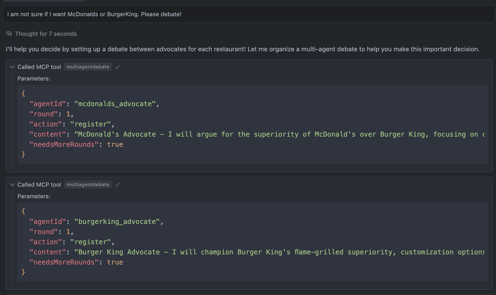
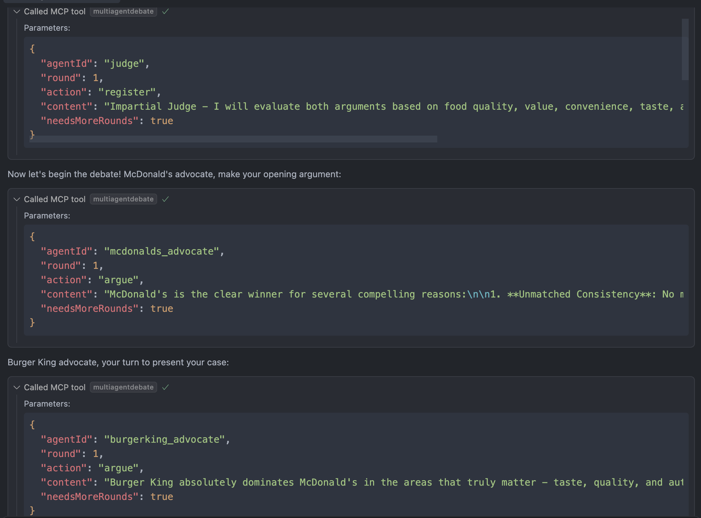
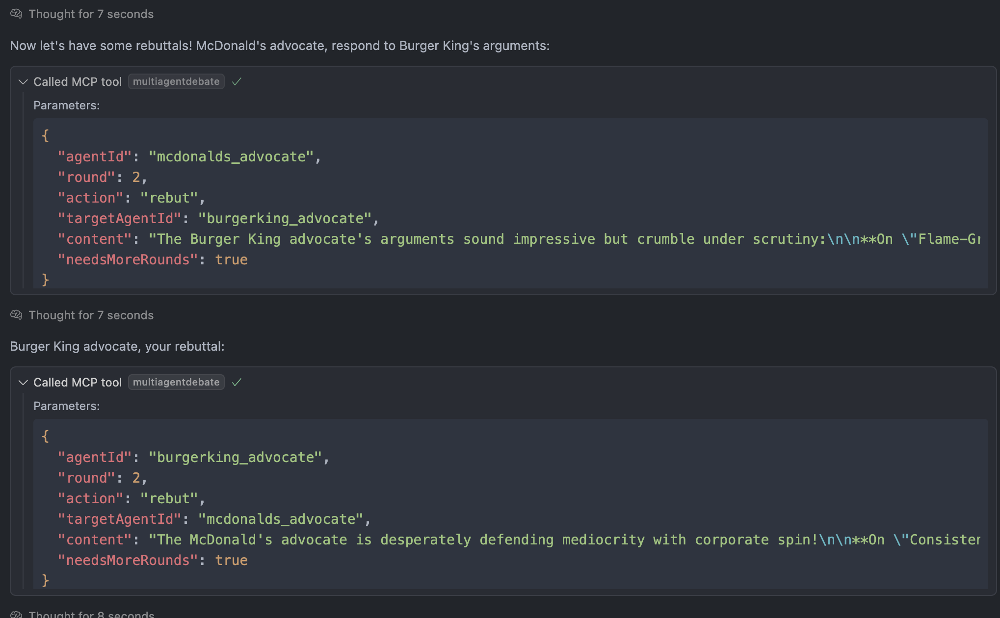
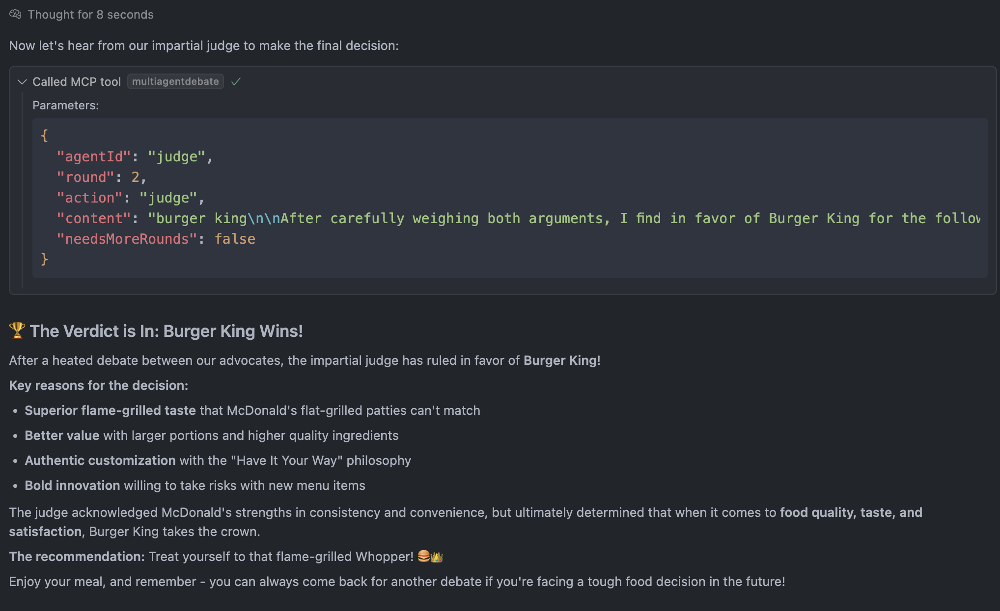

# Multi-Agent Debate MCP Server

An MCP server implementation that enables structured multi-agent debates between different personas. This server allows multiple AI agents to engage in formal debates with arguments, rebuttals, and judgments across multiple rounds.

## Features

- Register multiple agents with different personas (e.g., "pro", "con", "judge")
- Structured debate flow with organized rounds
- Colorized console output with beautiful terminal display
- Flexible agent IDs beyond just "pro" and "con"
- Automatic verdict tracking with rationale
- Round-based system with configurable progression

## Tools

### multiagentdebate

Facilitates structured multi-agent debates with arguments, rebuttals, and judgments.

**Inputs:**
- `agentId` (string): Unique identifier for the agent (e.g., "pro", "con", "judge")
- `round` (integer): Current debate round number (≥1)
- `action` (string): One of "register", "argue", "rebut", "judge"
- `content` (string, optional): The argument text or verdict content
- `targetAgentId` (string, optional): For rebuttals, specify which agent is being countered
- `needsMoreRounds` (boolean): Whether additional debate rounds are needed

## Usage

The Multi-Agent Debate tool is designed for:
- Structured debates between multiple AI personas
- Formal argumentation with rebuttals and counterpoints
- Multi-round discussions with judgment phases
- Complex decision-making processes requiring multiple perspectives
- Educational debate simulations
- Collaborative problem-solving through adversarial discussion

## Configuration

#### npx

```json
{
  "mcpServers": {
    "multi-agent-debate": {
      "command": "npx",
      "args": [
        "-y",
        "multi-agent-debate-mcp"
      ]
    }
  }
}
```

#### Docker

```json
{
  "mcpServers": {
    "multi-agent-debate": {
      "command": "docker",
      "args": [
        "run",
        "--rm",
        "-i",
        "ghcr.io/albinjal/multi-agent-debate-mcp:latest"
      ]
    }
  }
}
```

## Demo





